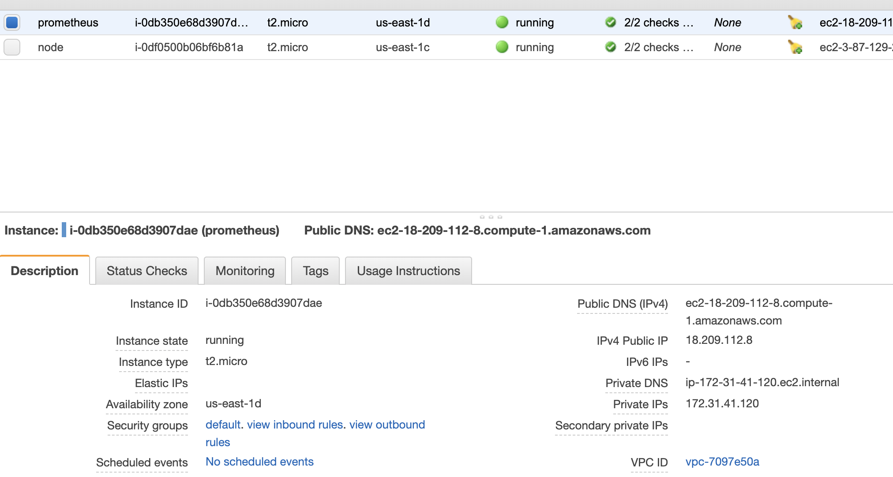
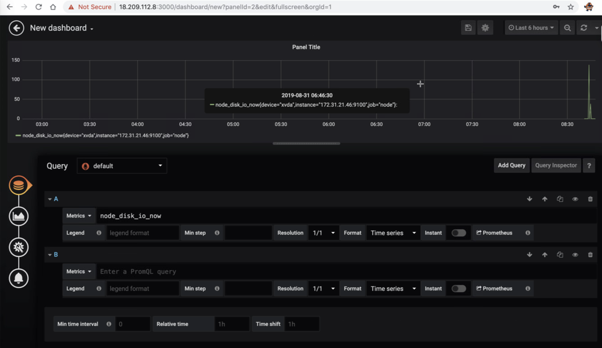

```
sudo yum install tcpdump
sudo yum install tmux
tmux
ctl+b %
ctl+b "
tmux a 
tmux ls
ctl+b q
ctl+b o
ctl+b x or exit
ctl+b n next screen
ctl+b c create a new screen

netcat
telnet
lsof

```
```
sudo netstat -tulpn | grep :9100
```
```
ssh-add centos-test.pem
ssh centos@ip
```
### https://docs.docker.com/install/linux/docker-ce/centos/

```
sudo yum install -y yum-utils \
  device-mapper-persistent-data \
  lvm2
```

```
sudo yum-config-manager \
    --add-repo \
    https://download.docker.com/linux/centos/docker-ce.repo

```
```
sudo yum install docker-ce docker-ce-cli containerd.io
sudo systemctl start docker
sudo usermod -a -G docker centos
docker ps
```
```
docker pull prom/prometheus
cd /opt
ls
sudo mkdir prometheus
cd prometheus
touch prometheus.yml
```
### this is for prometheus

set expandtab in vi
```
[root@ip-172-31-41-120 prometheus]# cat prometheus.yml
global:
    scrape_interval: 30s

scrape_configs:
  - job_name: 'node'
    static_configs:
     - targets: ['172.31.21.46:9100']

```

```
sudo cp /tmp/a prometheus.yml
```
```
sudo yum -y install nmap-ncat
nc -v 172.31.21.46 9100
docker run -d --name prometheus -p 9090:9090 -v /opt/prometheus/prometheus.yml:/etc/prometheus/prometheus.yml -v /opt/prometheus:/prometheus-data prom/prometheus
docker ps
docker logs -f prometheus

```


### this is for node

```
curl -L -o node_exporter.tar.gz https://github.com/prometheus/node_exporter/releases/download/v0.18.1/node_exporter-0.18.1.linux-amd64.tar.gz
tar -xf node_exporter.tar.gz
cd node_exporter-0.18.1.linux-amd64/
sudo cp node_exporter /usr/bin
sudo yum -y install tmux

```
add data in disk
```
dd if=/dev/zero of=/tmp/random
```


```
rm /tmp/random
```

```
docker run -d --name=grafana -p 3000:3000 grafana/grafana
docker logs -f grafana
```
http://18.209.112.8:3000
admin/123123





### set up node_exporter.service 
```
1. useradd -M node_exporter
2. create /etc/systemd/system/node_exporter.service
3.[centos@ip-172-31-21-46 system]$ cat node_exporter.service
[Unit]
Description=Node Exporter

[Service]
User=node_exporter
#EnvironmentFile=/etc/sysconfig/node_exporter
ExecStart=/usr/bin/node_exporter $OPTIONS

[Install]
WantedBy=multi-user.target
4. systemctl start node_exporter && systemctl enable node_exporter

