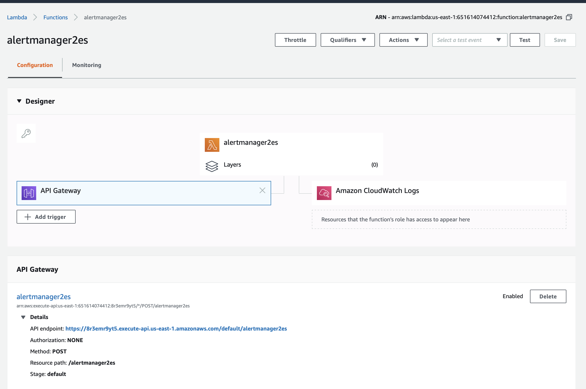
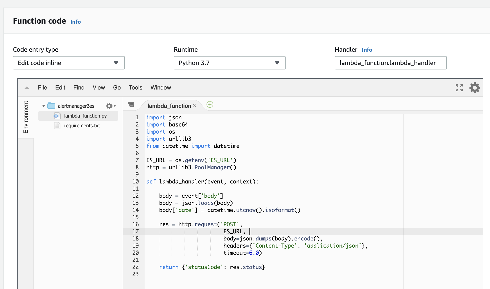
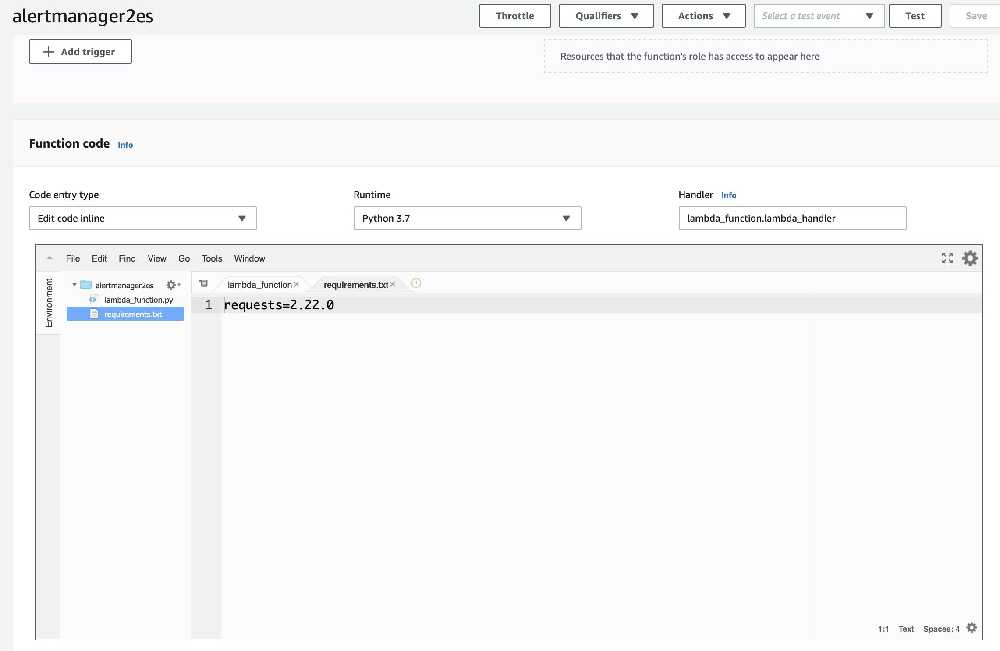

lambda_function.py
```
import json
import base64
import os
import urllib3
from datetime import datetime

ES_URL = os.getenv('ES_URL')
http = urllib3.PoolManager()

def lambda_handler(event, context):
    
    body = event['body']
    body = json.loads(body)
    body['date'] = datetime.utcnow().isoformat()

    res = http.request('POST', 
                        ES_URL, 
                        body=json.dumps(body).encode(), 
                        headers={'Content-Type': 'application/json'},
                        timeout=6.0)
    
    return {'statusCode': res.status}

```
